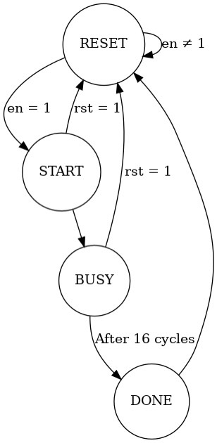
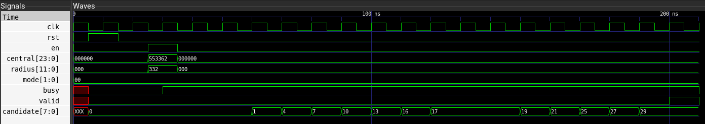

# FPGA-Set

> 2022 Spring  NCKU FPGA Course
>
> Homework 0 Set calculation
>
> E24076239 E24076297 E24076750

## Introduction

This homework is to design an RTL code to do the counting of the coordinates that satisfy the given type of set logic.

### Modes

1. Mode 1: Count the number of coordinates that covered by A.
2. Mode 2: Count the number of coordinates that covered by A & B
3. Mode 3: Count the number of coordinates that covered by A ^ B

4. Mode 4: Count the number of coordinates that covered by #[A, B, C] = 2

## Modules

1. **set** module

   The top module of our homework, combining all the other submodules

2. **controller** module

   Control the signals given by the `testbench.v`, and give the necessary signals to the other modules

3. **coord_gen** module

   Since our work would require few cycles to do the calculation, this module would output the coordinate one by one to the processing element

4. **buffer** module

   Buffer the input from the testbench. Since the testbench signals only exist in a cycle, we need to buffer the input for the future use

5. **PE** module

   Combinational circuit. The processing element, calculate if the given coordinate is inside of any of the circles

6. **LU** module

   Combinational circuit. The logic unit module. According to the given *mode* and the *output from PE* module, see if the coordinate satisfy the condition of such mode

7. **ACC** module

   According to all the LU results, accumulate all the satisfied coordinates and give the final output
   
   
   
   ### Schematic of our modules
   
   

### Details

1. In this homework, we utilized the hardware with four pairs of the processing units. So that we would need more than one cycles to accomplish the whole calculation. Also, since all the signals from the testbench only exist in one cycle, we implemented a sequential module **Buffer** so that the necessary inputs are able to be hold and pass to other elements when needed.
2. We implemented a **coord_gen** module to keep sending the coordinates to PE module. When the `coord_en` signal is given, the module will keep sending the coordinates to the PE. Each coord_gen instance is responsible for sending two rows of the grid, i.e. 16 coordinates.
3. The main calculation and logic circuits are based on the combinational modules: **PE** and **LU**. The PE takes the coordinate and the circles information as input, and output the 3-bit result which indicates whether the coordinate is inside the A, B or C circle. The calculation is based on the calculation of (Xc - X)^2+(Yc - Y)^2 <= R^2. We do the subtraction to see if the spot is inside the circle, if the result is negative, then the spot should be inside the circle. And for simplicity, we directly extract the MSB as the output of this module.
1. Then we pass these outputs to the **LU** module to do the further calculations. The input will be connected to the combinational circuits that are responsible for the four modes. We can therefore use the mode input as a selector to choose which output should we pass to the next module.
2. The four LUs will pass there results to the accumulator **ACC**. After the `acc_en` signal is high, the accumulator will start accumulating the results from the LUs. It would keep accumulating until the controller lower the `acc_en` signal. After the accumulation is finished, the result will be the final output candidates.

## FSM diagram

### States

1. **RESET** 

   Until receiving the `en`  signal, the next state will be **START**. Moreover, after the other states receiving `rst` signal, the state will change to **RESET** immediately. 

2. **START** 

   Set `busy` signal high, and start to calculate the result.

3. **BUSY** 

   There are 16 cycles in this state. **ACC** module start to update the value of `candidate`. 

4. **DONE**

   `candidate` signal is correct in this state, and set `valid` signal high. Next state is **RESET**.

## Simulation

These simulations are based on the same circle placement and test with different modes to see if the answer is correct.

### Setup

1. Circle A: (5, 5), R = 3
2. Circle B: (3, 3), R = 3
3. Circle C: (6, 2), R = 2

### Result

1. Mode 1

   

   Candidate result = 29

2. Mode 2

   

   Candidate result = 13

3. Mode 3

   

   Candidate result = 30

4. Mode 4

   

   Candidate result = 14

5. Simulation for the testbench

   

From the results above we could find out that all  the modes are correct in our circuit.

